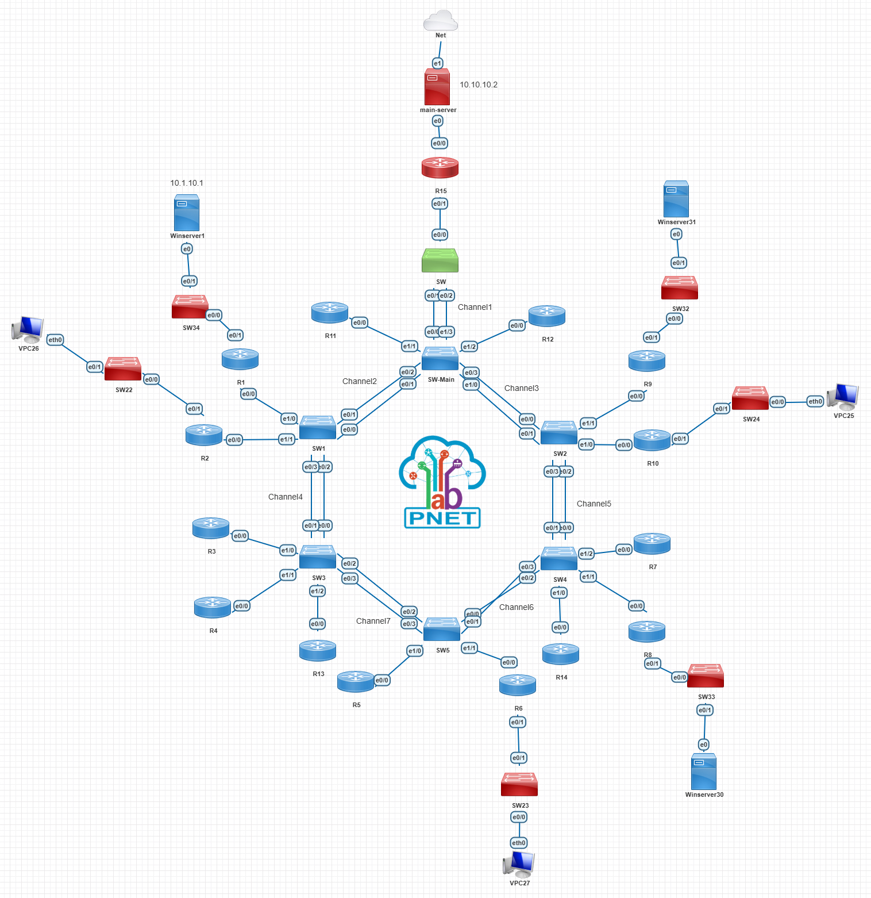

# 🌐 Multi-Protocol Enterprise Network Simulation (OSPF, EIGRP, BGP, & Hybrid NAT)

This project simulates a complex, large-scale enterprise network designed to showcase advanced skills in Routing, Switching, and Troubleshooting. The scenario involves multiple interior and exterior routing protocols, along with internet connectivity established via a hybrid NAT Gateway (Cisco Router + Windows Server).

---

## 🎯 Project Goals

*   Implement a multi-layer, star-topology using VLANs and Port-Channels (EtherChannel) at Layer 2.
*   Simultaneously utilize **OSPF** and **EIGRP** and perform **Redistribution** between them.
*   Establish connectivity with external networks (WAN) using **BGP** (AS 400 and AS 500).
*   Implement internet access for the entire internal network via **NAT** and troubleshoot the return path.
*   Successfully inject the **Default Route** across the entire multi-protocol network.

---

## 🛠️ Technologies and Tools Used

*   **Routing Protocols:** OSPF (Area 0 & 1), EIGRP (AS 1), BGP (AS 400 & 500)
*   **Switching:** VLANs, Trunking, Port-Channel (EtherChannel)
*   **NAT Implementation:** Hybrid NAT (Cisco Router R15 + Windows Server)
*   **Virtualization:** Cisco IOS (Simulated Environment like PNET/GNS3/EVE-NG)
*   **Operating System:** Windows Server (as the NAT Gateway)

---

## 🗺️ Network Topology



### 💡 Key Topology Notes

*   **Edge Router:** R15 serves as the exit point to the WAN/Internet.
*   **Routing Cores:** Routers like R13 and R14 act as ABR/ASBR to connect different protocols and Autonomous Systems.
*   **Internal Networks:** The network utilizes all three standard Private IP ranges (`10.x.x.x`, `172.16.x.x`, `192.168.x.x`).

---

## ✅ Final Configuration Summary

### 1. Default Route Injection (Crucial for Internet Access)

To ensure all internal routers know the path to the internet, the Default Route was successfully injected from R15 into OSPF, and then from R13 into EIGRP:

| Router | Protocol | Command |
| :--- | :--- | :--- |
| **R15** | OSPF | `default-information originate` |
| **R13** | EIGRP | `redistribute ospf 1 metric 10000 100 255 1 1500` |
| **R15** | BGP | `neighbor 10.14.15.1 default-originate` |

### 2. Hybrid NAT Gateway Configuration (Windows Server)

Since the Windows Server acts as the NAT Gateway, the most critical step was configuring the return path for internet traffic:

*   **R15:** Configured with a Default Route pointing to the Windows Server (`ip route 0.0.0.0 0.0.0.0 10.10.10.2`).
*   **Windows Server:** Required **Static Routes** to direct return traffic for all internal networks back to R15 (`10.10.10.1`).

```bash
# Static Routes added on Windows Server (Example)
route add 10.0.0.0 mask 255.0.0.0 10.10.10.1 -p
route add 172.16.0.0 mask 255.240.0.0 10.10.10.1 -p
route add 192.168.0.0 mask 255.255.0.0 10.10.10.1 -p
